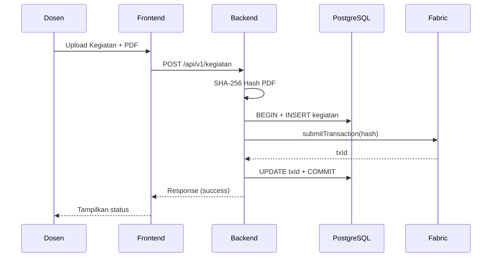

# Audit & Rekomendasi Plan ChainRank MVP
*Tanggal Audit: 29 April 2026*

---

## A. Hal yang Sudah Baik ✅

1. **Struktur plan sangat rapi** — pemisahan MVP vs Production (`plan.md` vs `plan-full.md`) tepat untuk konteks tugas kuliah
2. **Design Principles bagus** — modular architecture, env-based config, API versioning, centralized error handling, extensible schema sudah ditulis sejak awal
3. **Migration path jelas** — MVP → Production phases terdefinisi dengan checklist
4. **Schema database solid** — sudah ada soft delete, audit logs, indexes, `created_at`/`updated_at`
5. **Double-commit pattern** untuk PostgreSQL + Fabric sudah direncanakan dengan benar (BEGIN → INSERT → submitTransaction → UPDATE txId → COMMIT, ROLLBACK on error)
6. **Common pitfalls section** sangat membantu — CORS, JWT, Multer, Fabric errors

---

## B. Masalah & Gap yang Ditemukan 🔴

### 1. Progress vs Timeline: Kritis
Berdasarkan `docs/WEEK1_PROGRESS.md`, npm/Docker/PostgreSQL belum terinstall. Tapi backend sudah punya models & routes. Sementara **controllers, services, chaincode, dan frontend masih kosong**. Jika deadline 1 bulan dari awal, ini sudah masuk Minggu 2+ tapi masih di tahap awal Minggu 1.

### 2. Schema Inconsistency
Plan.md mendefinisikan tabel `kegiatan_dosen`, tapi model yang sudah ada di `backend/models/Kegiatan.js` dan schema files menggunakan nama yang mungkin berbeda. Ada 3 schema files (`schema.sql`, `schema-hybrid.sql`, `schema-existing.sql`) — **tidak jelas mana yang canonical**.

### 3. Missing Fabric Connection Strategy
Plan menyebut `fabric-network` SDK tapi **tidak ada di `package.json`**. Juga tidak ada detail tentang:
- Bagaimana wallet management untuk identities
- Connection profile configuration
- Error handling spesifik untuk Fabric gateway timeout/disconnect

### 4. Security Gap di MVP
Plan menandai security sebagai "Can Skip (P2)", tapi beberapa ini **harus ada bahkan di MVP**:
- **Input sanitization** — tanpa ini, XSS & SQL injection bisa terjadi di demo
- **File type validation yang proper** — hanya cek extension tidak cukup, harus cek magic bytes
- **JWT secret management** — plan menyebut `JWT_SECRET=your-secret-key-change-in-production` di `.env.example`, tapi tidak ada validasi bahwa secret harus strong

### 5. Tidak Ada Rollback Strategy untuk Fabric
Double-commit pattern di plan hanya handle "SQL ROLLBACK jika Fabric gagal". Tapi bagaimana jika:
- Fabric berhasil tapi UPDATE txId ke PostgreSQL gagal?
- Network timeout setelah Fabric submit tapi sebelum response diterima?

Ini menciptakan **data inconsistency** antara blockchain dan database.

### 6. Chaincode Testing Plan Kurang
Plan hanya bilang "Test chaincode dengan peer CLI commands" — tidak ada detail test case atau mock strategy.

### 7. Missing Error Recovery di Frontend
Plan tidak menyebut:
- Retry logic untuk failed uploads
- Offline handling
- Session expiry handling (JWT expired mid-session)

---

## C. Rekomendasi Tambahan 📋

### Prioritas Tinggi (Langsung Terapkan)

#### 1. Tentukan 1 schema canonical dan hapus yang lain
```
database/schema.sql       → GUNAKAN INI
database/schema-hybrid.sql → ARCHIVE atau HAPUS
database/schema-existing.sql → ARCHIVE atau HAPUS
```

#### 2. Tambahkan Fabric compensation/reconciliation mechanism
```sql
-- Jika Fabric sukses tapi DB update gagal:
-- 1. Log ke "pending_sync" table
-- 2. Background job untuk retry DB update
-- 3. Atau simpan txId di memory/file dulu, retry later

CREATE TABLE pending_blockchain_sync (
  id SERIAL PRIMARY KEY,
  kegiatan_id INTEGER,
  blockchain_tx_id VARCHAR(100),
  status VARCHAR(20) DEFAULT 'pending', -- pending, synced, failed
  retry_count INTEGER DEFAULT 0,
  created_at TIMESTAMP DEFAULT NOW()
);
```

#### 3. Tambahkan health check endpoint
```javascript
// GET /api/v1/health
{
  "status": "ok",
  "database": "connected",
  "blockchain": "connected", // atau "disconnected"
  "uptime": "..."
}
```
Penting untuk demo — dosen penguji bisa langsung lihat status semua komponen.

#### 4. Tambahkan Seed Data Script
Plan tidak menyebut ini. Untuk demo, kamu perlu:
```
database/seed.js
- 2-3 user (dosen, admin)
- 5-10 kegiatan sample
- Beberapa yang sudah verified, beberapa pending
```
Sangat krusial agar demo tidak dimulai dari database kosong.

#### 5. Tambahkan `.env` validation
```javascript
// Di server.js startup
const required = ['DB_HOST', 'DB_PASSWORD', 'JWT_SECRET'];
for (const key of required) {
  if (!process.env[key]) {
    console.error(`Missing required env: ${key}`);
    process.exit(1);
  }
}
```

### Prioritas Sedang (Kalau Sempat)

#### 6. Tambahkan Postman Collection di deliverables
Buat `docs/ChainRank.postman_collection.json` — sangat membantu saat demo dan testing.

#### 7. Docker Compose untuk development (bukan optional)
Plan menaruh Docker Compose di "Deployment Preparation (Optional)". Rekomendasinya: **pindah ke Minggu 1**. Satu `docker-compose.yml` dengan PostgreSQL + Fabric test-network akan sangat mempercepat setup dan reproduksi.

#### 8. Tambahkan Graceful Shutdown
```javascript
process.on('SIGTERM', async () => {
  await pool.end();           // Close DB connections
  await gateway.disconnect(); // Close Fabric gateway
  process.exit(0);
});
```

#### 9. Tambahkan section "Demo Script" di plan
```markdown
### Demo Script (5-10 menit)
1. Tunjukkan architecture diagram (30 detik)
2. Register & Login sebagai dosen (1 menit)
3. Upload kegiatan dengan PDF (2 menit)
4. Tunjukkan data di PostgreSQL (psql query) (1 menit)
5. Tunjukkan hash di blockchain (peer CLI) (1 menit)
6. Tampering demo: edit file → verify → detect (2 menit)
7. Tunjukkan audit trail timeline (1 menit)
8. Closing: architecture recap (30 detik)
```

### Prioritas Rendah (Nice to Have)

#### 10. Tambahkan Sequence Diagram di README


#### 11. Tambahkan Fallback Mode
Jika Fabric network down saat demo, backend tetap bisa jalan dengan mode "database-only" (`blockchain_tx_id = NULL`, `status = 'pending_blockchain'`). Ini safety net yang penting.

---

## D. Restrukturisasi Timeline yang Disarankan

Mengingat progress saat ini (masih di tahap awal), disarankan **restrukturisasi sisa waktu**:

| Hari | Fokus |
|------|-------|
| 1-2 | Fix environment (npm, PostgreSQL, Docker), run schema, seed data |
| 3-5 | Backend controllers + services (CRUD kegiatan, file upload, hash) |
| 6-7 | Chaincode development + deployment ke test-network |
| 8-9 | Fabric SDK integration + double-commit pattern |
| 10-12 | Frontend: Login, Dashboard, Upload form |
| 13-14 | Frontend: Detail kegiatan, audit trail, hash verification |
| 15-16 | Integration testing + bug fixing |
| 17-18 | Documentation (README, laporan, slides) |
| 19-20 | Demo video + final polish |

> **Key insight**: Backend + Chaincode harus selesai sebelum mulai frontend. Jangan paralel — akan banyak rework.

---

## E. Checklist Aksi Segera

- [ ] Pilih 1 schema canonical, archive sisanya
- [ ] Install `fabric-network` ke `package.json`
- [ ] Buat `database/seed.js`
- [ ] Buat `GET /api/v1/health` endpoint
- [ ] Tambahkan `.env` validation di `server.js`
- [ ] Buat minimal 1 controller + 1 service sebagai template pattern
- [ ] Setup Docker Compose dengan PostgreSQL
- [ ] Mulai chaincode development (`chaincode/kegiatan.js`)

---

*Dokumen ini adalah hasil audit terhadap `plan.md` dan `plan-full.md` serta kondisi implementasi aktual per 29 April 2026.*
