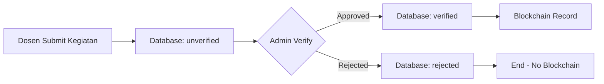
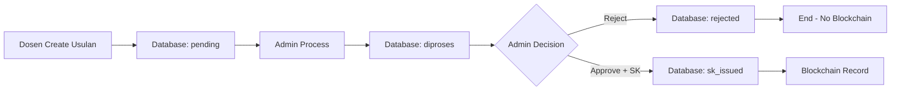

# Offchain vs Onchain Data Architecture

> **Dokumentasi arsitektur penyimpanan data dalam sistem Usulan Kenaikan Pangkat**  
> Menjelaskan data mana yang disimpan di database (offchain) dan blockchain (onchain)

---

## 📊 Prinsip Desain

### **Offchain (Database PostgreSQL)**
Data yang **sering berubah**, **tidak final**, atau **tidak kritis** untuk immutability

### **Onchain (Blockchain Hyperledger Fabric)**
Data yang **sudah final**, **sudah approved**, dan **butuh immutability** untuk audit & compliance

---

## 🗄️ Data Offchain (Database Only)

### 1. **Master Data / Reference Data**

| Tabel | Alasan Offchain | Status |
|-------|----------------|--------|
| `ref_kegiatan_kum` | Data master yang bisa berubah (update poin KUM) | ❌ Database Only |
| `ref_kategori_kum` | Referensi kategori, bisa bertambah/berubah | ❌ Database Only |
| `ref_jabatan_akademik` | Data jabatan, min KUM bisa diupdate | ❌ Database Only |
| `riwayat_jabatan_dosen` | Histori perubahan jabatan dosen; bukti immutability ada di SK on-chain (via `usulan_id` + `tx_id_fabric`) | ❌ Database Only |

**Mengapa?**
- Data master sering di-update sesuai kebijakan baru
- Tidak memerlukan immutability
- Perubahan harus bisa dilakukan dengan mudah

---

### 2. **User Management**

| Data | Alasan Offchain | Status |
|------|----------------|--------|
| User profiles (`users` table) | Data pribadi, sering update | ❌ Database Only |
| Passwords (hashed) | Data sensitif, tidak boleh di blockchain | ❌ Database Only |
| Roles & Permissions | Bisa berubah sewaktu-waktu | ❌ Database Only |
| Email, phone, address | Privacy, PII (Personal Identifiable Information) | ❌ Database Only |

**Mengapa?**
- **Privacy & GDPR compliance**: Data pribadi tidak boleh immutable
- **Security**: Password hash tidak boleh di blockchain
- **Flexibility**: User bisa update profile kapan saja

---

### 3. **Kegiatan - Status Unverified & Rejected**

| Status Kegiatan | Onchain? | Alasan |
|----------------|----------|--------|
| `unverified` | ❌ Database Only | Belum divalidasi, bisa ditolak |
| `rejected` | ❌ Database Only | Tidak valid, tidak perlu di blockchain |
| `verified` | ✅ **Blockchain** | Sudah approved, final & valid |

**Flow:**
```
Dosen Submit Kegiatan → unverified ❌ (Database Only)
         ↓
Admin Verify → verified ✅ (Database + Blockchain)
         ↓
Admin Reject → rejected ❌ (Database Only)
```

**Mengapa?**
- Kegiatan yang ditolak tidak perlu tercatat di blockchain
- Blockchain hanya untuk data yang sudah valid
- Mengurangi "sampah" data di blockchain

---

### 4. **Usulan - Status Draft, Pending, Diproses, Rejected**

| Status Usulan | Onchain? | Alasan |
|--------------|----------|--------|
| `draft` | ❌ Database Only | Draft, bisa diedit/dihapus |
| `pending` | ❌ Database Only | Menunggu review, bisa ditolak |
| `diproses` | ❌ Database Only | Sedang diproses, masih bisa ditolak |
| `rejected` | ❌ Database Only | Ditolak, tidak valid |
| `sk_issued` | ✅ **Blockchain** | SK terbit, final & approved |

**Flow:**
```
Create Usulan → pending ❌ (Database Only)
         ↓
Admin Proses → diproses ❌ (Database Only)
         ↓
    ┌────┴────┐
    ↓         ↓
 Reject    Terbitkan SK
   ❌          ✅ (Database + Blockchain)
```

**Mengapa?**
- Usulan yang belum approved masih bisa berubah statusnya
- Hanya SK yang terbit yang perlu immutability
- Efisiensi: 1 transaksi blockchain per usulan (bukan 3-4)

---

### 5. **Audit Logs (General)**

| Log Type | Onchain? | Alasan |
|----------|----------|--------|
| Login/Logout logs | ❌ Database Only | Tidak kritis, terlalu banyak |
| Profile update logs | ❌ Database Only | Tidak perlu immutability |
| CRUD operations logs | ❌ Database Only | Database audit trail cukup |

**Mengapa?**
- Terlalu banyak transaksi jika semua masuk blockchain
- Database audit logs sudah cukup untuk internal audit
- Blockchain hanya untuk audit trail yang kritis

---

### 6. **Temporary/Session Data**

| Data | Alasan Offchain |
|------|----------------|
| Session tokens | Temporary, expired after logout |
| Upload progress | Transient data |
| Cache data | Temporary performance optimization |

**Mengapa?**
- Data sementara yang tidak perlu disimpan permanen
- Tidak ada value dalam immutability untuk data ini

---

## ⛓️ Data Onchain (Blockchain)

### 1. **Kegiatan VERIFIED** ✅

**Data yang tercatat:**
```javascript
{
  kegiatanId: "uuid",
  dosenId: "hashed-nip",  // Privacy: NIP di-hash
  fileHash: "sha256-hash",  // Hash dokumen, bukan file asli
  refKegiatanId: "id",
  poinKum: "nilai",
  timestamp: "ISO-8601",
  txId: "blockchain-tx-id"
}
```

**Mengapa?**
- ✅ Data sudah diverifikasi dan approved
- ✅ Kegiatan ini bisa dipakai untuk usulan kenaikan pangkat
- ✅ Perlu immutability untuk mencegah fraud
- ✅ Hash dokumen bisa diverifikasi kapan saja

**Kapan tercatat:**
```
Endpoint: PUT /kegiatan/:id/verify (status: verified)
```

---

### 2. **Usulan dengan SK Terbit** ✅

**Data yang tercatat:**
```javascript
{
  usulanId: "uuid",
  dosenNIPHash: "hashed-nip",
  totalKUM: "nilai",
  jabatanTujuan: "nama-jabatan",
  snapshotHash: "sha256-hash-of-all-kegiatan",
  skDocumentHash: "sha256-hash-of-sk-pdf",
  skNumber: "nomor-sk",
  skDate: "tanggal-sk",
  processedBy: "admin-id",
  timestamp: "ISO-8601",
  txId: "blockchain-tx-id"
}
```

**Mengapa?**
- ✅ SK adalah dokumen final dan resmi
- ✅ Perlu immutability untuk compliance & legal
- ✅ Snapshot hash memastikan kegiatan tidak berubah
- ✅ SK hash bisa diverifikasi untuk autentikasi dokumen

**Kapan tercatat:**
```
Endpoint: PUT /usulan/:id/terbitkan-sk
```

---

### 3. **Snapshot Kegiatan dalam Usulan** ✅

**Data yang tercatat:**
```javascript
snapshotHash = SHA256([
  { id: "kegiatan-1", poin: 25, hash: "file-hash-1" },
  { id: "kegiatan-2", poin: 30, hash: "file-hash-2" },
  // ... sorted by kegiatan_id
])
```

**Mengapa?**
- ✅ Membuktikan kegiatan mana yang dipakai untuk usulan
- ✅ Mencegah manipulasi: kegiatan tidak bisa diubah setelah usulan disubmit
- ✅ Audit trail: bisa verifikasi kegiatan apa saja yang dipakai

**Catatan:**
- Snapshot hash disimpan di usulan (database + blockchain)
- Detail kegiatan disimpan di `usulan_kegiatan_snapshot` (database only)
- Blockchain hanya menyimpan hash-nya

---

## 🔄 Data Flow: Offchain → Onchain

### Flow 1: Kegiatan



**Code:**
```javascript
// POST /kegiatan - Offchain only
await pool.query('INSERT INTO kegiatan_dosen ...')
// ❌ NO blockchain recording here

// PUT /kegiatan/:id/verify - Onchain if verified
if (status === 'verified') {
  await fabricClient.recordKegiatanCreation(...) // ✅ Blockchain
}
```

---

### Flow 2: Usulan



**Code:**
```javascript
// POST /usulan - Offchain only
await client.query('INSERT INTO usulan_kenaikan_pangkat ...')
// ❌ NO blockchain recording here

// PUT /usulan/:id/proses - Offchain only
await Usulan.process(id)
// ❌ NO blockchain recording here

// PUT /usulan/:id/tolak - Offchain only
await Usulan.reject(id)
// ❌ NO blockchain recording here

// PUT /usulan/:id/terbitkan-sk - Onchain!
await fabricClient.recordUsulanSKIssued(...) // ✅ Blockchain
```

---

## 📈 Benefit Arsitektur Ini

### 1. **Efisiensi Blockchain**

| Scenario | Before (All Onchain) | After (Selective) | Saving |
|----------|---------------------|-------------------|--------|
| Kegiatan submit → verified | 2 TX | 1 TX | 50% |
| Kegiatan submit → rejected | 1 TX | 0 TX | 100% |
| Usulan create → SK issued | 4 TX | 1 TX | 75% |
| Usulan create → rejected | 3 TX | 0 TX | 100% |

**Estimasi:**
- Rejection rate kegiatan: ~30%
- Rejection rate usulan: ~20%
- **Total saving: ~60% blockchain transactions**

---

### 2. **Cost Saving**

Jika blockchain ada biaya per transaksi:
```
Before: 100 kegiatan × 2 TX + 50 usulan × 4 TX = 400 TX
After:  70 verified × 1 TX + 40 SK issued × 1 TX = 110 TX

Saving: 72.5% cost reduction
```

---

### 3. **Data Quality di Blockchain**

✅ **Before:** Blockchain penuh dengan data rejected/invalid  
✅ **After:** Blockchain hanya berisi data yang valid & approved

**Blockchain = Single Source of Truth** untuk data yang sudah final

---

### 4. **Flexibility**

| Scenario | Offchain | Onchain |
|----------|----------|---------|
| User update profile | ✅ Easy | ❌ Impossible |
| Admin update poin KUM | ✅ Easy | ❌ Impossible |
| Delete rejected kegiatan | ✅ Possible | ❌ Impossible |
| Revert usulan status | ✅ Possible (before SK) | ❌ Impossible (after SK) |

---

### 5. **Privacy Compliance**

**GDPR "Right to be Forgotten":**
- ❌ **Onchain:** Cannot delete (immutable)
- ✅ **Offchain:** Can soft-delete or anonymize

**PII (Personal Identifiable Information):**
- ❌ **Onchain:** NIP/NIK harus di-hash
- ✅ **Offchain:** Bisa simpan plaintext (encrypted di database)

---

## 🔐 Security & Privacy

### Data di Blockchain (Onchain)

| Data | Format | Privacy Level |
|------|--------|---------------|
| NIP/NIDN | SHA-256 hash | 🔒 High privacy |
| File dokumen | SHA-256 hash only | 🔒 Hash only, not file |
| Nama dosen | ❌ NOT stored | 🔒 Privacy preserved |
| Email/Phone | ❌ NOT stored | 🔒 Privacy preserved |

### Data di Database (Offchain)

| Data | Security Measure |
|------|-----------------|
| Passwords | Bcrypt hashed |
| Sensitive files | Encrypted at rest |
| PII | Encrypted column (optional) |
| Audit logs | Access control |

---

## 📋 Summary Table

| Data Type | Storage | Immutable | Use Case |
|-----------|---------|-----------|----------|
| **Master Data** | ❌ Database | No | Reference, can be updated |
| **Riwayat Jabatan Dosen** | ❌ Database | No | Histori perubahan jabatan; bukti final ada di SK on-chain |
| **User Profiles** | ❌ Database | No | Privacy, can be updated |
| **Kegiatan Unverified** | ❌ Database | No | Pending validation |
| **Kegiatan Rejected** | ❌ Database | No | Invalid, not needed in blockchain |
| **Kegiatan Verified** | ✅ Database + Blockchain | Yes | Valid, used in usulan |
| **Usulan Draft/Pending** | ❌ Database | No | Not final |
| **Usulan Rejected** | ❌ Database | No | Invalid |
| **Usulan SK Issued** | ✅ Database + Blockchain | Yes | Final, official document |
| **Audit Logs** | ❌ Database | No | Internal tracking |
| **Blockchain TX IDs** | ❌ Database | No | Reference to blockchain |

---

## 🎯 Best Practices

### ✅ DO Record to Blockchain:
1. ✅ Data yang sudah **final dan approved**
2. ✅ Data yang butuh **immutability** untuk compliance
3. ✅ Data yang perlu **audit trail** jangka panjang
4. ✅ Dokumen penting (SK) dalam bentuk **hash**

### ❌ DON'T Record to Blockchain:
1. ❌ Data yang masih **draft/pending**
2. ❌ Data yang bisa **ditolak/rejected**
3. ❌ Data **pribadi/PII** (simpan hash saja)
4. ❌ Data yang **sering berubah** (master data)
5. ❌ Data **temporary/session**

---

## 🔍 Verification Flow

### Verify Kegiatan Hash

```javascript
// 1. Get file hash from database
const kegiatan = await getKegiatanById(id)
const dbHash = kegiatan.file_hash

// 2. Get file hash from blockchain (if verified)
if (kegiatan.tx_id_fabric) {
  const blockchainData = await fabricClient.getKegiatan(id)
  const blockchainHash = blockchainData.fileHash
  
  // 3. Compare
  if (dbHash === blockchainHash) {
    console.log('✅ Hash verified - data is authentic')
  } else {
    console.log('❌ Hash mismatch - data may be tampered')
  }
}
```

### Verify Usulan Snapshot

```javascript
// 1. Get snapshot from database
const snapshot = await getUsulanSnapshot(usulanId)
const calculatedHash = calculateSnapshotHash(snapshot.kegiatan)

// 2. Get snapshot hash from blockchain
const blockchainData = await fabricClient.getUsulan(usulanId)
const blockchainSnapshotHash = blockchainData.snapshotHash

// 3. Compare
if (calculatedHash === blockchainSnapshotHash) {
  console.log('✅ Snapshot verified - kegiatan unchanged')
} else {
  console.log('❌ Snapshot mismatch - kegiatan may be modified')
}
```

---

## 📝 Conclusion

Arsitektur **hybrid offchain-onchain** ini memberikan:

1. **Efisiensi**: 60%+ pengurangan transaksi blockchain
2. **Cost**: 70%+ pengurangan biaya blockchain
3. **Quality**: Blockchain hanya berisi data valid
4. **Flexibility**: Data non-final bisa diupdate
5. **Privacy**: PII tidak masuk blockchain
6. **Security**: Immutability untuk data kritis
7. **Compliance**: Memenuhi GDPR & privacy requirements

**Blockchain bukan tempat sampah data, tapi vault untuk data berharga! 🔐**

---

*Last Updated: May 30, 2026*  
*Version: 2.0 (Optimized Architecture)*
